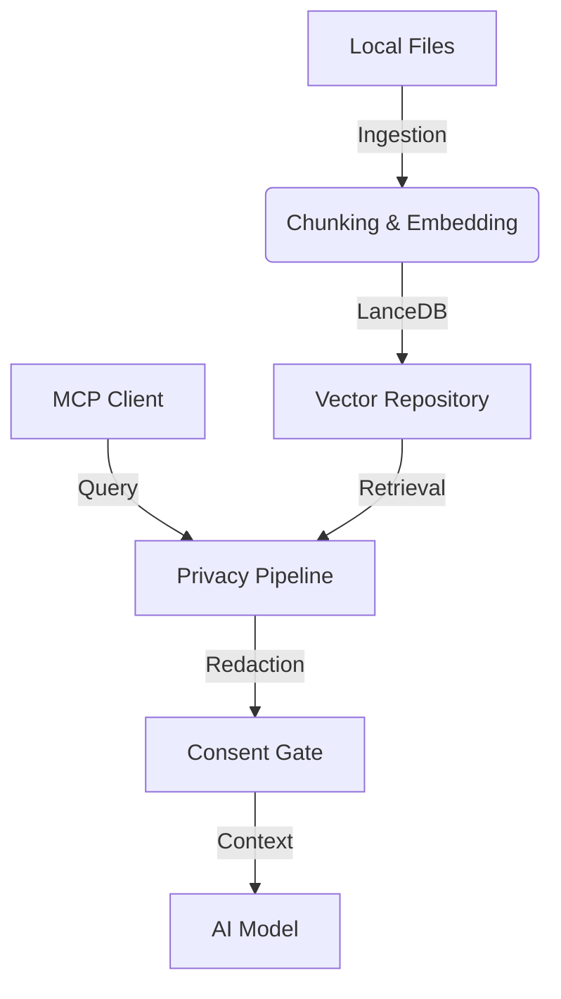

# 🧠 Personal Memory Gateway (PMG)

> **The Privacy-First Memory Layer for AI.**  
> Seamlessly bridge your local knowledge with any AI assistant through a secure, MCP-compatible gateway.

[](https://www.npmjs.com/package/@shubham-01-star/pmg)
[](LICENSE)
[](https://modelcontextprotocol.io)

---

## 🚀 Quick Start

Get up and running in seconds with zero configuration:

```bash
npx @shubham-01-star/pmg init
```

---

## ✨ Overview

Personal Memory Gateway (PMG) is a local-first backend designed to store, manage, and serve your personal knowledge to AI models. It acts as a secure "VPN for your memory," ensuring that sensitive data is redacted and privacy is gated before any context is shared.

### 🛠️ Core Capabilities

- **MCP Tool Integration**: Seamlessly connects to Cursor, Claude Desktop, and other MCP clients via `query_personal_memory` and `save_memory` tools.
- **Privacy-First Ingestion**: Automatically watches local directories, chunks documents, and stores them in a local vector database (LanceDB).
- **Intelligent Redaction**: Applies a multi-stage pipeline to redact PII and sensitive information before retrieval.
- **Archestra Integration**: Optionally route responses through high-performance gateways like Archestra (supporting Gemini/OpenAI).
- **Telemetry Dashboard**: Monitor system health and manage your indexed data through a built-in web interface.

---

## 🏗️ Architecture



---

## 📦 Installation

### Global Install (Recommended)

```bash
npm i -g @shubham-01-star/pmg
pmg init
pmg
```

### Local Development

```bash
git clone https://github.com/shubham-01-star/pmg.git
cd pmg
npm install
npm run build
npm run run
```

---

## 🔌 MCP Client Configuration

Add PMG to your `mcpServers` configuration:

```json
{
  "mcpServers": {
    "pmg": {
      "command": "npx",
      "args": ["-y", "@shubham-01-star/pmg"],
      "env": {
        "INGEST_DIR": "/path/to/your/data",
        "LANCE_DB_PATH": "/path/to/lancedb/storage"
      }
    }
  }
}
```

---

## ⚙️ Environment Variables

| Variable             | Description                                      | Default   |
| :------------------- | :----------------------------------------------- | :-------- |
| `INGEST_DIR`         | Directory to watch for memory files              | `my_data` |
| `ARCHESTRA_ENABLE`   | Enable Archestra integration (`0` or `1`)        | `0`       |
| `EMBEDDING_PROVIDER` | Embedding model source (`local`, `gemini`, etc.) | `local`   |
| `DASHBOARD_PORT`     | Port for the telemetry dashboard                 | `8787`    |
| `PRIVACY_REDACT_PII` | Enable PII redaction pipeline                    | `1`       |

---

## 📊 Dashboard

Once running, access the telemetry dashboard at:
👉 **[http://localhost:8787/dashboard](http://localhost:8787/dashboard)**

- **Monitor**: Real-time events and memory retrieval stats.
- **Manage**: Upload new documents or clear existing memories.
- **Status**: Visual health probes for all internal services.

---

## 🧪 Testing & Verification

PMG includes a comprehensive suite of smoke tests and backend validations.

```bash
# Run backend smoke suite
make test-backend

# Integrated flow test
node scripts/one-command-flow.mjs "topic" "path/to/sample.txt"
```

---

## 📜 License

Distributed under the MIT License. See `LICENSE` for more information.

---

<p align="center">
  Built with ❤️ for the <b>2 Fast 2 MCP Hackathon</b>
</p>
